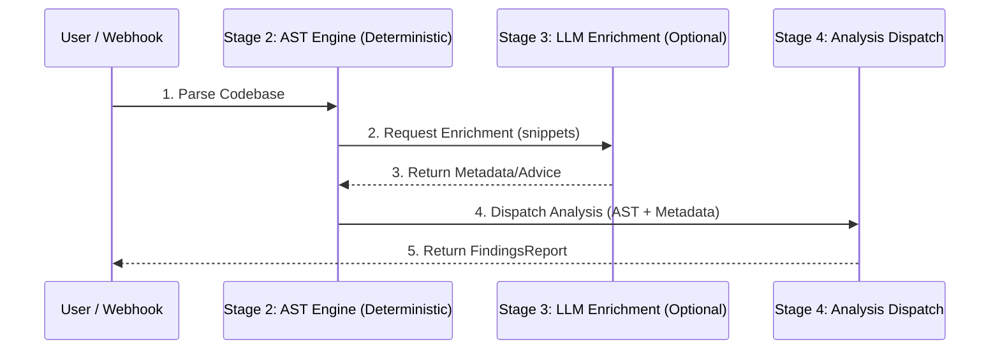

# JMCRA — Java Microservices Code Review Agent

JMCRA is a high-precision, Abstract Syntax Tree (AST) based static analysis engine designed specifically for modern Java microservices. Unlike generic linters, JMCRA understands framework-specific patterns, version-based deprecations, and complex architectural requirements like structured concurrency and reactive safety.

## 🧠 Core Capabilities

### 1. Version-Aware Intelligence
JMCRA is aware of the evolution of the Java ecosystem. It dynamically adjusts its rule set based on the detected versions of:
*   **Java SDK**: (17 LTS through 25 LTS)
*   **Spring Boot**: (3.x through 4.x)
*   **Cloud Frameworks**: Spring Cloud, Kafka, etc.

### 2. Hybrid Analysis: AST + LLM
JMCRA uses a unique hybrid approach:
*   **AST (Deterministic)**: JavaParser identifies structural violations (e.g., missing @Transactional).
*   **LLM (Cognitive Enrichment)**: Large Language Models provide human-like reasoning for semantic issues and remediation advice.

### 4. Two-Tier LLM Strategy (Stage 3)
JMCRA orchestrates LLMs across two performance tiers to balance cost and capability:
*   **Tier 1 (Fast)**: Uses lightweight models (e.g., Claude Haiku, Gemini Flash) for quick pattern classification and severity labeling.
*   **Tier 2 (Deep)**: Uses high-reasoning models (e.g., Claude Sonnet, Gemini Pro) for complex architectural anti-patterns, N+1 query analysis, and contract diffs.

> [!IMPORTANT]
> **AST is the Ground Truth**: For critical severity findings, the LLM is used for enrichment only. Deterministic AST evidence is required to break a build gate.

### 5. Rule Domains
*   **SEC (Security)**: Hardcoded secrets, SQL injection, missing method-level security.
*   **CON (Concurrency)**: Structured concurrency safety, Scoped Value leaks, reactive blocking.
*   **DAT (Data Access)**: JPA N+1 detection, `@Transactional` misuse.
*   **RES (Resilience)**: Missing Circuit Breakers, improper Retry policies.
*   **API (Interface)**: Manual URL versioning, response code standard violations.

---

## 🏗️ The Analysis Pipeline

### Execution Flow

### Stage Details
1.  **Ingest**: Resolves local or remote repositories and validates scan requests.
2.  **Parse & Index**: Generates the AST, call graphs, and metadata. **This was the primary engine for the Sandbox Scan.**
3.  **LLM Enrichment (Asynchronous)**: Gathers spec context and uses Tier 1/2 LLMs for semantic classification and remediation advice refinement. (Note: Stubbed during sandbox validation to ensure test repeatability).
4.  **Analysis Dispatch**: Filters and executes rules based on version gating.
5.  **Rank & Dedupe**: Merges findings, applies suppressions, and calculates the Health Score.
6.  **Delivery**: Fans out reports to GitHub, Slack, and the Compliance Dashboard.

---

## 🛠️ Sandbox Case Study: Results

We used a specialized **Sandbox Application** to validate JMCRA's accuracy. The sandbox contains deliberate "vulnerabilities" and "anti-patterns" across 1000+ files.

### Example Findings detected by JMCRA:

#### 1. Modern Concurrency Safety (Java 25)
*   **Rule**: `CON-011` (StructuredTaskScope not closed)
*   **Detection**: Identified that `new StructuredTaskScope.ShutdownOnFailure()` was instantiated without a `try-with-resources` block in `ModernJavaService.java:37`.
*   **Impact**: Prevents resource leaks and orphaned thread sub-tasks.

#### 2. Security Infrastructure
*   **Rule**: `SEC-001` (Hardcoded Credentials)
*   **Detection**: Found a Base64-encoded AWS secret literal in `EvasionController.java`.
*   **Remediation**: Recommends moving secrets to environment variables or Vault.

#### 3. Database Performance
*   **Rule**: `DAT-001` (N+1 Query Problem)
*   **Detection**: Caught a `@OneToMany` mapping in `NPlusOneEntity.java` missing a `@BatchSize`.
*   **Impact**: Prevents database "query storms" that degrade microservice latency.

#### 4. Critical Dependency Risks
*   **Rule**: `DEP-001` (CVE Detection)
*   **Detection**: Identified `org.apache.logging.log4j:log4j-core:2.14.1` in the build file.
*   **Severity**: CRITICAL (CVSS 10.0).

---

## 📊 Health Score & Reporting
JMCRA calculates a **Health Score** based on the weighted density of findings.
*   **Critical/High** findings significantly penalize the score.
*   **Version Gates** allow JMCRA to act as a CI/CD gatekeeper, preventing "regression" into older, less safe patterns.